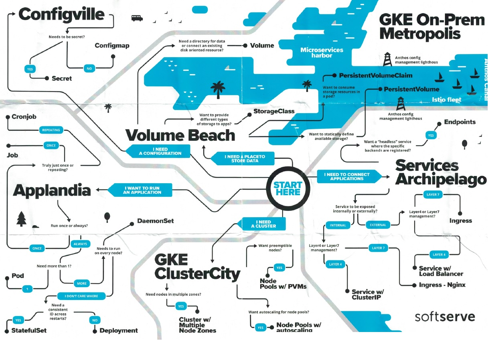

# Kubernetes

## Kuberentes Site Concepts/Tasks/Tutorials

* [On Different Setups (self/cloud/managed)](https://kubernetes.io/docs/setup/)

* [Kubernetes Concepts](https://kubernetes.io/docs/concepts/)

* [Kubernetes Tasks](https://kubernetes.io/docs/tasks/)

* [Kubernetes Tutorials](https://kubernetes.io/docs/tutorials/)

## Articles on Ubuntu Installation

*  [How to install on Ubuntu 18](https://geekflare.com/install-kubernetes-on-ubuntu/)

## On Networking

* [Nice Article with lots of explanations](https://rancher.com/blog/2019/2019-03-21-comparing-kubernetes-cni-providers-flannel-calico-canal-and-weave/)

## Book on Kubernetes Internals 

* [Kubebuilder Book](https://kubebuilder.io/)

## Can the Master also be a worker?
* Yes: [See this posting](https://stackoverflow.com/questions/43147941/allow-scheduling-of-pods-on-kubernetes-master)
```
kubectl taint nodes --all node-role.kubernetes.io/master-
```

## API Objects 

A full description can be here on [API Concepts](ttps://kubernetes.io/docs/reference/using-api/api-concepts/)


* API Object Specification
    *  [Standrd API Terminology](https://kubernetes.io/docs/reference/using-api/api-concepts/#standard-api-terminology) (Directly from the Kubernetes)
        * Kubernetes generally leverages standard RESTful terminology to describe the API concepts:
            * A ___resource type___ is the name used in the URL (pods, namespaces, services)
            * All resource types have a concrete representation in JSON (their object schema) which is called a ___kind___
            * A list of instances of a resource type is known as a ___collection___
            * A single instance of the resource type is called a ___resource___

* Complete list of Kubernetes Resource Types
    * You can always list them:
        * ```kubectl api-resources```
    * We also provided an Excel Spreadsheet version with some notes
        * [API Object Table](Kubernetes-API-Objects.xlsx)
    * ```kubectl explain``` also can provide brief descriptions
        * ```kubectl explain <Object Kind> [--recursive=true]```
        * Examples:
            >
            ```
            # Get the documentation of the resource and its fields
            kubectl explain pods

            # Get the documentation of a specific field of a resource
            kubectl explain pods.spec.containers
            ```   
    * The full API Object Specification can be gotten via the [Kubernetes API Reference Documentation (1.17)](https://kubernetes.io/docs/reference/generated/kubernetes-api/v1.17/)

## Writing a Kuberenetes Operator
* [Ross Soll's KubeBuilder Tutorial at KubeCon 2019](https://youtu.be/KBTXBUVNF2I?list=PLj6h78yzYM2NDs-iu8WU5fMxINxHXlien)
    * [Tutorial Slides Here](https://pres.metamagical.dev/kubecon-us-2019/)
        * Note UX is not obvious. To view next/prev slide just click somewhere on page then use left/right arrows
    * [Code for Tutorial on GitHub](https://github.com/DirectXMan12/kubebuilder-workshops/tree/kubecon-us-2019)

## Fun diagram


