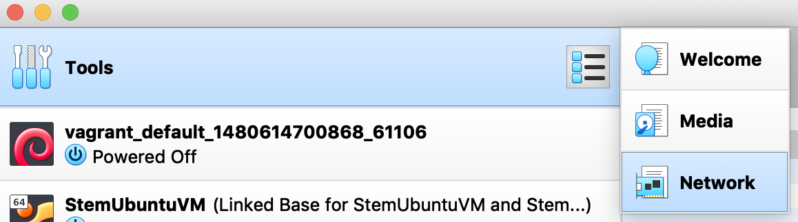
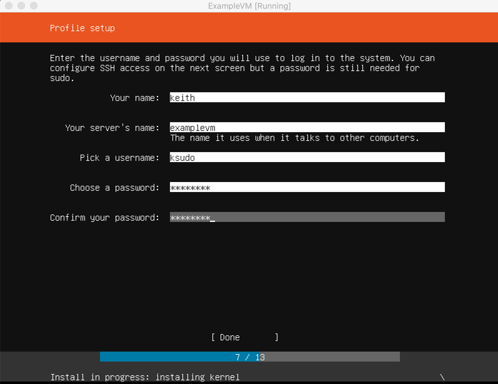

# Setting up VMs using Virtual Box 

External Links
* [Virtual Box Website](https://www.virtualbox.org/)

* [Setting up Ubuntu Server 18.04 on VirtualBox 6](https://hadisinaee.github.io/posts/setting-up-vbox6/)

* [How to Network Virtual Machines in VirtualBox](https://study.com/academy/lesson/)  Paid Site, but the beginning is visible/useful

* The most common network types in VirtualBox

| VM<=>Host | VM<=>VM | VM<=>External network | External network<=>VM | VM's IP Visiblity to the External Network |
|------ | ------ | ------ | ------ | ------ |------ |
| NAT | No | No | Yes | Yes(Port forwarding) | Hidden |
| Host-only | Yes | Yes | No | No | Hidden |
| Bridged | Yes | Yes | Yes | Yes | Visible |

- - - 
- - - 

# Setting up a "Stem" or "Base" VM Image

It is a repetitive and slow process to set up a VM and install your base Linux for every node in your cluster.

VirtualBox has the ability to 'clone' images from other images with the clones having an 'overlay' file system on top of the clone's.  

A common technique is to create a base image of your OS (ie Ubuntu) and then create clones based on that so you don't have to do the full install again.

> There are other ways to do this with things like Teraform, but that is out of the scope of this study group

There are several sets to setting up the Stem VM:
 - [Creating the Host-only Adapter](#creating-the-host-only-adapter)
 - [Initializing the VM](#initializing-the-vm)
 - [Setting up Ubuntu 18.04](#setting-up-ubuntu-1804)
 - [Cloning the Stem VM](#cloning-the-stem-vm)
 - [Assigning the VMs a Static IP Address](#assigning-the-vms-a-static-ip-address)

## Creating the Host-only Adapter

1. Download and open up VirtualBox 
2. Go to the Tools section in the top left section of the window and select Network form the side menu
   
3. Create a new network. If you haven't done this previously it should be named vboxnet0
   
4. Enable the DHCP Server

## Initializing the VM

1. Click on the new button on the top of the window
2. Name the VM, select linux as the type, and Ubuntu (64-bit) for the version
   
   
   
3. Leave the RAM at the recommended
   
   

4. Select "Create a virtual hard disk now"
   
   

5. Select the VDI option for the hard disk file type
   
   

6. Select dynamically allocated
   
   

7. Leave the file location and size at the recommended values
   
   

8. Select your new VM and select the settings button on the top of the window
   
   

9. Go to the Network tab at the top. Make sure adapter 1 is set to NAT.
    
    
  
10. Go to the adapter 2 tab and enable it. Then make it attached to the host-only network you made previously

  

11. Save the settings and run the VM so that you can set up Ubuntu

## Setting up Ubuntu 18.04
1. When you start your new VM select the Ubuntu 18.04 .iso file.
   
   

2. Go through the setup and don't change anything from the default for the first 7 screens
   
3. Set up your profile on the profile set up screen
   
   

4. Enable the install OpenSSH server option.
   
    

5. Click through the rest of the screens and the setup should start. Make sure your computer is charging while this is happening or else it might fail. It can also fail randomly, in which case delete the VM and start over.

6. When it's done reboot it and it should bring up the login screen.

## Cloning the Stem VM

## Assigning the VMs a Static IP Address

  - Config for file /etc/netplan/50-cloud-init.yaml
    